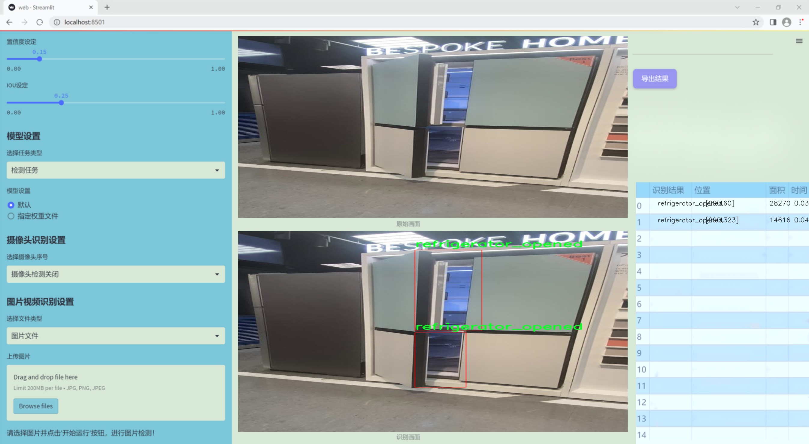

# 改进yolo11-GhostDynamicConv等200+全套创新点大全：家庭门窗开闭状态安全监控系统源码＆数据集全套

### 1.图片效果展示





##### 项目来源 **[人工智能促进会 2024.11.01](https://kdocs.cn/l/cszuIiCKVNis)**

注意：由于项目一直在更新迭代，上面“1.图片效果展示”和“2.视频效果展示”展示的系统图片或者视频可能为老版本，新版本在老版本的基础上升级如下：（实际效果以升级的新版本为准）

  （1）适配了YOLOV11的“目标检测”模型和“实例分割”模型，通过加载相应的权重（.pt）文件即可自适应加载模型。

  （2）支持“图片识别”、“视频识别”、“摄像头实时识别”三种识别模式。

  （3）支持“图片识别”、“视频识别”、“摄像头实时识别”三种识别结果保存导出，解决手动导出（容易卡顿出现爆内存）存在的问题，识别完自动保存结果并导出到tempDir中。

  （4）支持Web前端系统中的标题、背景图等自定义修改。

  另外本项目提供训练的数据集和训练教程,暂不提供权重文件（best.pt）,需要您按照教程进行训练后实现图片演示和Web前端界面演示的效果。

### 2.视频效果展示

[2.1 视频效果展示](https://www.bilibili.com/video/BV1ixDPYuEAw/)

### 3.背景

研究背景与意义

随着智能家居技术的迅速发展，家庭安全监控系统逐渐成为现代家庭生活中不可或缺的一部分。传统的安全监控手段往往依赖于人工监控或简单的报警系统，难以实现实时、智能化的安全防护。近年来，基于深度学习的目标检测技术，尤其是YOLO（You Only Look Once）系列模型，因其高效性和准确性而受到广泛关注。YOLOv11作为该系列的最新版本，具有更快的检测速度和更高的精度，适合应用于家庭安全监控领域。

本研究旨在基于改进的YOLOv11模型，开发一套家庭门窗开闭状态的安全监控系统。该系统将通过实时监测家庭门窗的状态，及时识别潜在的安全隐患，提升家庭安全防护能力。我们所使用的数据集包含5900张图像，涵盖了三类主要目标：门的开闭状态、窗户的开闭状态以及气体设备的开关状态。这些类别不仅包括门窗的开闭状态（door_closed、door_opened、window_closed、window_opened），还涉及到家庭日常生活中可能存在的安全隐患，如气体设备的开启与关闭（gas_turn_on、gas_turn_off）以及冰箱的状态（refrigerator_closed、refrigerator_opened）。通过对这些状态的监测，系统能够及时发出警报，防止意外事故的发生。

此外，家庭安全监控系统的智能化升级，不仅能够提升家庭成员的安全感，还能有效降低因人为疏忽而导致的财产损失。通过引入深度学习技术，我们期望能够实现更高效的监测与识别，推动家庭安全监控技术的进一步发展。因此，本研究不仅具有重要的理论意义，还有着广泛的实际应用前景，为智能家居的安全防护提供了新的解决方案。

### 4.数据集信息展示

##### 4.1 本项目数据集详细数据（类别数＆类别名）

nc: 9
names: ['Fall_Detected', 'door_closed', 'door_opened', 'gas_turn_off', 'gas_turn_on', 'refrigerator_closed', 'refrigerator_opened', 'window_closed', 'window_opened']


该项目为【目标检测】数据集，请在【训练教程和Web端加载模型教程（第三步）】这一步的时候按照【目标检测】部分的教程来训练

##### 4.2 本项目数据集信息介绍

本项目数据集信息介绍

本项目所使用的数据集名为“Security-Detection”，旨在为改进YOLOv11的家庭门窗开闭状态安全监控系统提供强有力的支持。该数据集共包含9个类别，涵盖了家庭安全监控中常见的状态，具体包括“Fall_Detected”（跌倒检测）、“door_closed”（门关闭）、“door_opened”（门打开）、“gas_turn_off”（燃气关闭）、“gas_turn_on”（燃气开启）、“refrigerator_closed”（冰箱关闭）、“refrigerator_opened”（冰箱打开）、“window_closed”（窗户关闭）以及“window_opened”（窗户打开）。这些类别的设计充分考虑了家庭日常生活中的安全隐患，旨在通过智能监控系统及时识别和响应潜在的危险。

数据集中的每个类别均经过精心标注，确保模型在训练过程中能够准确学习到不同状态的特征。跌倒检测类别尤其重要，因为它直接关系到家庭成员的安全，尤其是老年人。门窗和燃气的状态监控则是家庭安全的基础，及时的状态变化检测能够有效预防事故的发生。冰箱的开闭状态监控不仅有助于食品安全，还能通过智能化管理提升家庭生活的便利性。

在数据集的构建过程中，考虑到了多样性和真实场景的复杂性，数据来源于不同的家庭环境，以确保模型的泛化能力。通过对这些状态的有效监测，改进后的YOLOv11模型将能够实时分析家庭环境的安全状况，提供及时的警报和反馈，从而大幅提升家庭安全防护的智能化水平。整体而言，“Security-Detection”数据集为本项目的成功实施奠定了坚实的基础，期待通过这一数据集的应用，推动家庭安全监控技术的进一步发展。


### 5.全套项目环境部署视频教程（零基础手把手教学）

[5.1 所需软件PyCharm和Anaconda安装教程（第一步）](https://www.bilibili.com/video/BV1BoC1YCEKi/?spm_id_from=333.999.0.0&vd_source=bc9aec86d164b67a7004b996143742dc)


[5.2 安装Python虚拟环境创建和依赖库安装视频教程（第二步）](https://www.bilibili.com/video/BV1ZoC1YCEBw?spm_id_from=333.788.videopod.sections&vd_source=bc9aec86d164b67a7004b996143742dc)

### 6.改进YOLOv11训练教程和Web_UI前端加载模型教程（零基础手把手教学）

[6.1 改进YOLOv11训练教程和Web_UI前端加载模型教程（第三步）](https://www.bilibili.com/video/BV1BoC1YCEhR?spm_id_from=333.788.videopod.sections&vd_source=bc9aec86d164b67a7004b996143742dc)


按照上面的训练视频教程链接加载项目提供的数据集，运行train.py即可开始训练



     Epoch   gpu_mem       box       obj       cls    labels  img_size
     1/200     20.8G   0.01576   0.01955  0.007536        22      1280: 100%|██████████| 849/849 [14:42<00:00,  1.04s/it]
               Class     Images     Labels          P          R     mAP@.5 mAP@.5:.95: 100%|██████████| 213/213 [01:14<00:00,  2.87it/s]
                 all       3395      17314      0.994      0.957      0.0957      0.0843

     Epoch   gpu_mem       box       obj       cls    labels  img_size
     2/200     20.8G   0.01578   0.01923  0.007006        22      1280: 100%|██████████| 849/849 [14:44<00:00,  1.04s/it]
               Class     Images     Labels          P          R     mAP@.5 mAP@.5:.95: 100%|██████████| 213/213 [01:12<00:00,  2.95it/s]
                 all       3395      17314      0.996      0.956      0.0957      0.0845

     Epoch   gpu_mem       box       obj       cls    labels  img_size
     3/200     20.8G   0.01561    0.0191  0.006895        27      1280: 100%|██████████| 849/849 [10:56<00:00,  1.29it/s]
               Class     Images     Labels          P          R     mAP@.5 mAP@.5:.95: 100%|███████   | 187/213 [00:52<00:00,  4.04it/s]
                 all       3395      17314      0.996      0.957      0.0957      0.0845


###### [项目数据集下载链接](https://kdocs.cn/l/cszuIiCKVNis)

### 7.原始YOLOv11算法讲解

##### YOLO11简介

> YOLO11源码地址：https://github.com/ultralytics/ultralytics

Ultralytics
YOLO11是一款尖端的、最先进的模型，它在之前YOLO版本成功的基础上进行了构建，并引入了新功能和改进，以进一步提升性能和灵活性。YOLO11设计快速、准确且易于使用，使其成为各种物体检测和跟踪、实例分割、图像分类以及姿态估计任务的绝佳选择。  


**YOLO11创新点如下:**

YOLO 11主要改进包括：  
`增强的特征提取`：YOLO 11采用了改进的骨干和颈部架构，增强了特征提取功能，以实现更精确的目标检测。  
`优化的效率和速度`：优化的架构设计和优化的训练管道提供更快的处理速度，同时保持准确性和性能之间的平衡。  
`更高的精度，更少的参数`：YOLO11m在COCO数据集上实现了更高的平均精度（mAP），参数比YOLOv8m少22%，使其在不影响精度的情况下提高了计算效率。  
`跨环境的适应性`：YOLO 11可以部署在各种环境中，包括边缘设备、云平台和支持NVIDIA GPU的系统。  
`广泛的支持任务`：YOLO 11支持各种计算机视觉任务，如对象检测、实例分割、图像分类、姿态估计和面向对象检测（OBB）。

**YOLO11不同模型尺寸信息：**

YOLO11 提供5种不同的型号规模模型，以满足不同的应用需求：

Model| size (pixels)| mAPval 50-95| Speed CPU ONNX (ms)| Speed T4 TensorRT10
(ms)| params (M)| FLOPs (B)  
---|---|---|---|---|---|---  
YOLO11n| 640| 39.5| 56.1 ± 0.8| 1.5 ± 0.0| 2.6| 6.5  
YOLO11s| 640| 47.0| 90.0 ± 1.2| 2.5 ± 0.0| 9.4| 21.5  
YOLO11m| 640| 51.5| 183.2 ± 2.0| 4.7 ± 0.1| 20.1| 68.0  
YOLO11l| 640| 53.4| 238.6 ± 1.4| 6.2 ± 0.1| 25.3| 86.9  
YOLO11x| 640| 54.7| 462.8 ± 6.7| 11.3 ± 0.2| 56.9| 194.9  
  
**模型常用训练超参数参数说明：**  
`YOLOv11
模型的训练设置包括训练过程中使用的各种超参数和配置`。这些设置会影响模型的性能、速度和准确性。关键的训练设置包括批量大小、学习率、动量和权重衰减。此外，优化器、损失函数和训练数据集组成的选择也会影响训练过程。对这些设置进行仔细的调整和实验对于优化性能至关重要。  
**以下是一些常用的模型训练参数和说明：**

参数名| 默认值| 说明  
---|---|---  
`model`| `None`| 指定用于训练的模型文件。接受指向 `.pt` 预训练模型或 `.yaml`
配置文件。对于定义模型结构或初始化权重至关重要。  
`data`| `None`| 数据集配置文件的路径（例如
`coco8.yaml`).该文件包含特定于数据集的参数，包括训练数据和验证数据的路径、类名和类数。  
`epochs`| `100`| 训练总轮数。每个epoch代表对整个数据集进行一次完整的训练。调整该值会影响训练时间和模型性能。  
`patience`| `100`| 在验证指标没有改善的情况下，提前停止训练所需的epoch数。当性能趋于平稳时停止训练，有助于防止过度拟合。  
`batch`| `16`| 批量大小，有三种模式:设置为整数(例如，’ Batch =16 ‘)， 60% GPU内存利用率的自动模式(’ Batch
=-1 ‘)，或指定利用率分数的自动模式(’ Batch =0.70 ')。  
`imgsz`| `640`| 用于训练的目标图像尺寸。所有图像在输入模型前都会被调整到这一尺寸。影响模型精度和计算复杂度。  
`device`| `None`| 指定用于训练的计算设备：单个 GPU (`device=0`）、多个 GPU (`device=0,1`)、CPU
(`device=cpu`)，或苹果芯片的 MPS (`device=mps`).  
`workers`| `8`| 加载数据的工作线程数（每 `RANK` 多 GPU 训练）。影响数据预处理和输入模型的速度，尤其适用于多 GPU 设置。  
`name`| `None`| 训练运行的名称。用于在项目文件夹内创建一个子目录，用于存储训练日志和输出结果。  
`pretrained`| `True`| 决定是否从预处理模型开始训练。可以是布尔值，也可以是加载权重的特定模型的字符串路径。提高训练效率和模型性能。  
`optimizer`| `'auto'`| 为训练模型选择优化器。选项包括 `SGD`, `Adam`, `AdamW`, `NAdam`,
`RAdam`, `RMSProp` 等，或 `auto` 用于根据模型配置进行自动选择。影响收敛速度和稳定性  
`lr0`| `0.01`| 初始学习率（即 `SGD=1E-2`, `Adam=1E-3`) .调整这个值对优化过程至关重要，会影响模型权重的更新速度。  
`lrf`| `0.01`| 最终学习率占初始学习率的百分比 = (`lr0 * lrf`)，与调度程序结合使用，随着时间的推移调整学习率。  


**各损失函数作用说明：**  
`定位损失box_loss`：预测框与标定框之间的误差（GIoU），越小定位得越准；  
`分类损失cls_loss`：计算锚框与对应的标定分类是否正确，越小分类得越准；  
`动态特征损失（dfl_loss）`：DFLLoss是一种用于回归预测框与目标框之间距离的损失函数。在计算损失时，目标框需要缩放到特征图尺度，即除以相应的stride，并与预测的边界框计算Ciou
Loss，同时与预测的anchors中心点到各边的距离计算回归DFLLoss。  


### 8.200+种全套改进YOLOV11创新点原理讲解

#### 8.1 200+种全套改进YOLOV11创新点原理讲解大全

由于篇幅限制，每个创新点的具体原理讲解就不全部展开，具体见下列网址中的改进模块对应项目的技术原理博客网址【Blog】（创新点均为模块化搭建，原理适配YOLOv5~YOLOv11等各种版本）

[改进模块技术原理博客【Blog】网址链接](https://gitee.com/qunmasj/good)


#### 8.2 精选部分改进YOLOV11创新点原理讲解

###### 这里节选部分改进创新点展开原理讲解(完整的改进原理见上图和[改进模块技术原理博客链接](https://gitee.com/qunmasj/good)【如果此小节的图加载失败可以通过CSDN或者Github搜索该博客的标题访问原始博客，原始博客图片显示正常】


### FocalModulation模型的基本原理
参考该博客，Focal Modulation Networks（FocalNets）的基本原理是替换自注意力（Self-Attention）模块，使用焦点调制（focal modulation）机制来捕捉图像中的长距离依赖和上下文信息。下图是自注意力和焦点调制两种方法的对比。


自注意力要求对每个查询令牌（Query Token）与其他令牌进行复杂的查询-键（Query-Key）交互和查询-值（Query-Value）聚合，以计算注意力分数并捕捉上下文。而焦点调制则先将空间上下文以不同粒度聚合到调制器中，然后以查询依赖的方式将这些调制器注入到查询令牌中。焦点调制简化了交互和聚合操作，使其更轻量级。在图中，自注意力部分使用红色虚线表示查询-键交互和黄色虚线表示查询-值聚合，而焦点调制部分则用蓝色表示调制器聚合和黄色表示查询-调制器交互。 

FocalModulation模型通过以下步骤实现：

1. 焦点上下文化：用深度卷积层堆叠来编码不同范围的视觉上下文。


2. 门控聚合：通过门控机制，选择性地将上下文信息聚合到每个查询令牌的调制器中。


3. 逐元素仿射变换：将聚合后的调制器通过仿射变换注入到每个查询令牌中。

下面来分别介绍这三个机制->

#### 焦点上下文化
焦点上下文化（Focal Contextualization）是焦点调制（Focal Modulation）的一个组成部分。焦点上下文化使用一系列深度卷积层（depth-wise convolutional layers）来编码不同范围内的视觉上下文信息。这些层可以捕捉从近处到远处的视觉特征，从而允许网络在不同层次上理解图像内容。通过这种方式，网络能够在聚合上下文信息时保持对局部细节的敏感性，并增强对全局结构的认识。


​

这张图详细比较了自注意力（Self-Attention, SA）和焦点调制（Focal Modulation）的机制，并特别展示了焦点调制中的上下文聚合过程。左侧的图展示了自注意力模型如何通过键（k）和查询（q）之间的交互，以及随后的聚合来生成输出。而中间和右侧的图说明了焦点调制如何通过层级化的上下文聚合和门控聚合过程替代自注意力模型的这一过程。在焦点调制中，输入首先通过轻量级线性层进行处理，然后通过层级化的上下文化模块和门控机制来选择性地聚合信息，最终通过调制器与查询（q）进行交互以生成输出。

#### 门控聚合
在Focal Modulation Networks（FocalNets）中的 "门控聚合"（Gated Aggregation）是关键组件之一，这一过程涉及使用门控机制来选择性地聚合上下文信息。以下是这个过程的详细分析：

1. 什么是门控机制？
门控机制在深度学习中常用于控制信息流。它通常用于决定哪些信息应该被传递，哪些应该被阻断。在循环神经网络（RNN）中，特别是在长短期记忆网络（LSTM）和门控循环单元（GRU）中，门控机制用于调节信息在时间序列数据中的流动。

2. 门控聚合的目的
在FocalNets中，门控聚合的目的是为每个查询令牌（即处理中的数据单元）选择性地聚合上下文信息。这意味着网络能够决定哪些特定的上下文信息对于当前处理的查询令牌是重要的，从而专注于那些最相关的信息。

3. 如何实现门控聚合？
实现门控聚合可能涉及一系列计算步骤，其中包括：

计算上下文信息：这可能涉及使用深度卷积层（如文中提到的）对输入图像的不同区域进行编码，以捕捉从局部到全局的视觉上下文。
门控操作：这一步骤涉及到一个决策过程，根据当前查询令牌的特征来决定哪些上下文信息是相关的。这可能通过一个学习到的权重（门）来实现，该权重决定了不同上下文信息的重要性。
信息聚合：最后，根据门控操作的结果，选择性地聚合上下文信息到一个调制器中。这个调制器随后被用于调整或“调制”查询令牌的表示。
4. 门控聚合的好处
通过门控聚合，FocalNets能够更有效地聚焦于对当前任务最关键的信息。这种方法提高了模型的效率和性能，因为它减少了不必要信息的处理，同时增强了对关键特征的关注。在视觉任务中，这可能意味着更好的目标检测和图像分类性能，特别是在复杂或多变的视觉环境中。

总结：门控聚合是FocalNets的一个核心组成部分，它通过选择性地集中处理重要的上下文信息来提升网络的效率和性能。

#### 逐元素仿射变换
在Focal Modulation Networks（FocalNets）中的第三个关键组件是逐元素仿射变换，这个步骤涉及将通过门控聚合得到的调制器注入到每个查询令牌中。以下是该过程的详细分析：

1. 仿射变换的基本概念：
仿射变换是一种线性变换，用于对数据进行缩放、旋转、平移和倾斜等操作。在深度学习中，逐元素的仿射变换通常指的是对每个元素进行线性变换，这种变换可以被描述为y = ax + b，其中x是输入，y是输出，a和b是变换的参数。

2. 逐元素仿射变换的作用：
在FocalNets中，逐元素仿射变换的作用是将聚合后的调制器信息注入到每个查询令牌中。这个步骤对于整合上下文信息和查询令牌的原始特征非常重要。通过这种方式，调制器所包含的上下文信息可以直接影响查询令牌的表示。

3. 执行仿射变换：
执行这一步骤时，聚合后的调制器对每个查询令牌进行逐元素的仿射变换。在实践中，这可能意味着对查询令牌的每个特征应用调制器中的相应权重（a）和偏差（b）。这样，调制器中的每个元素都直接对应于查询令牌的一个特征，通过调整这些特征来改变其表达。

4. 仿射变换的效果：
通过逐元素仿射变换，模型能够更细致地调整每个查询令牌的特征，根据上下文信息来增强或抑制某些特征。这种精细的调整机制允许网络更好地适应复杂的视觉场景，提高对细节的捕捉能力，从而提升了模型在各种视觉任务中的性能，如目标检测和图像分类。

总结：逐元素仿射变换它使得模型能够利用上下文信息来有效地调整查询令牌，增强了模型对关键视觉特征的捕捉和表达能力。


### 9.系统功能展示

图9.1.系统支持检测结果表格显示

  图9.2.系统支持置信度和IOU阈值手动调节

  图9.3.系统支持自定义加载权重文件best.pt(需要你通过步骤5中训练获得)

  图9.4.系统支持摄像头实时识别

  图9.5.系统支持图片识别

  图9.6.系统支持视频识别

  图9.7.系统支持识别结果文件自动保存

  图9.8.系统支持Excel导出检测结果数据


### 10. YOLOv11核心改进源码讲解

#### 10.1 lsknet.py

以下是经过简化和注释的核心代码部分，保留了最重要的结构和功能：

```python
import torch
import torch.nn as nn
from functools import partial

class Mlp(nn.Module):
    """ 多层感知机模块，包含两个卷积层和一个深度卷积层 """
    def __init__(self, in_features, hidden_features=None, out_features=None, act_layer=nn.GELU, drop=0.):
        super().__init__()
        out_features = out_features or in_features  # 输出特征数
        hidden_features = hidden_features or in_features  # 隐藏层特征数
        self.fc1 = nn.Conv2d(in_features, hidden_features, 1)  # 第一个卷积层
        self.dwconv = DWConv(hidden_features)  # 深度卷积层
        self.act = act_layer()  # 激活函数
        self.fc2 = nn.Conv2d(hidden_features, out_features, 1)  # 第二个卷积层
        self.drop = nn.Dropout(drop)  # Dropout层

    def forward(self, x):
        x = self.fc1(x)
        x = self.dwconv(x)
        x = self.act(x)
        x = self.drop(x)
        x = self.fc2(x)
        x = self.drop(x)
        return x


class LSKblock(nn.Module):
    """ LSK模块，包含空间卷积和注意力机制 """
    def __init__(self, dim):
        super().__init__()
        self.conv0 = nn.Conv2d(dim, dim, 5, padding=2, groups=dim)  # 深度卷积
        self.conv_spatial = nn.Conv2d(dim, dim, 7, stride=1, padding=9, groups=dim, dilation=3)  # 空间卷积
        self.conv1 = nn.Conv2d(dim, dim//2, 1)  # 1x1卷积
        self.conv2 = nn.Conv2d(dim, dim//2, 1)  # 1x1卷积
        self.conv_squeeze = nn.Conv2d(2, 2, 7, padding=3)  # 压缩卷积
        self.conv = nn.Conv2d(dim//2, dim, 1)  # 1x1卷积

    def forward(self, x):   
        attn1 = self.conv0(x)  # 通过深度卷积
        attn2 = self.conv_spatial(attn1)  # 通过空间卷积

        attn1 = self.conv1(attn1)  # 1x1卷积
        attn2 = self.conv2(attn2)  # 1x1卷积
        
        attn = torch.cat([attn1, attn2], dim=1)  # 拼接
        avg_attn = torch.mean(attn, dim=1, keepdim=True)  # 平均注意力
        max_attn, _ = torch.max(attn, dim=1, keepdim=True)  # 最大注意力
        agg = torch.cat([avg_attn, max_attn], dim=1)  # 拼接平均和最大注意力
        sig = self.conv_squeeze(agg).sigmoid()  # 压缩并激活
        attn = attn1 * sig[:,0,:,:].unsqueeze(1) + attn2 * sig[:,1,:,:].unsqueeze(1)  # 加权组合
        attn = self.conv(attn)  # 最终卷积
        return x * attn  # 乘以输入


class Attention(nn.Module):
    """ 注意力模块 """
    def __init__(self, d_model):
        super().__init__()
        self.proj_1 = nn.Conv2d(d_model, d_model, 1)  # 投影层
        self.activation = nn.GELU()  # 激活函数
        self.spatial_gating_unit = LSKblock(d_model)  # LSK模块
        self.proj_2 = nn.Conv2d(d_model, d_model, 1)  # 投影层

    def forward(self, x):
        shortcut = x.clone()  # 残差连接
        x = self.proj_1(x)
        x = self.activation(x)
        x = self.spatial_gating_unit(x)
        x = self.proj_2(x)
        x = x + shortcut  # 残差连接
        return x


class Block(nn.Module):
    """ 网络中的基本块，包含注意力和多层感知机 """
    def __init__(self, dim, mlp_ratio=4., drop=0., drop_path=0., act_layer=nn.GELU):
        super().__init__()
        self.norm1 = nn.BatchNorm2d(dim)  # 第一层归一化
        self.norm2 = nn.BatchNorm2d(dim)  # 第二层归一化
        self.attn = Attention(dim)  # 注意力模块
        self.mlp = Mlp(in_features=dim, hidden_features=int(dim * mlp_ratio), act_layer=act_layer, drop=drop)  # MLP模块

    def forward(self, x):
        x = x + self.attn(self.norm1(x))  # 注意力连接
        x = x + self.mlp(self.norm2(x))  # MLP连接
        return x


class OverlapPatchEmbed(nn.Module):
    """ 图像到补丁的嵌入 """
    def __init__(self, img_size=224, patch_size=7, stride=4, in_chans=3, embed_dim=768):
        super().__init__()
        self.proj = nn.Conv2d(in_chans, embed_dim, kernel_size=patch_size, stride=stride, padding=(patch_size // 2))  # 卷积嵌入
        self.norm = nn.BatchNorm2d(embed_dim)  # 归一化层

    def forward(self, x):
        x = self.proj(x)  # 卷积嵌入
        x = self.norm(x)  # 归一化
        return x


class LSKNet(nn.Module):
    """ LSK网络结构 """
    def __init__(self, img_size=224, in_chans=3, embed_dims=[64, 128, 256, 512], depths=[3, 4, 6, 3]):
        super().__init__()
        self.num_stages = len(embed_dims)  # 网络阶段数

        for i in range(self.num_stages):
            patch_embed = OverlapPatchEmbed(img_size=img_size // (2 ** i), in_chans=in_chans if i == 0 else embed_dims[i - 1], embed_dim=embed_dims[i])
            block = nn.ModuleList([Block(dim=embed_dims[i]) for _ in range(depths[i])])  # 生成多个Block
            norm = nn.BatchNorm2d(embed_dims[i])  # 归一化层
            setattr(self, f"patch_embed{i + 1}", patch_embed)  # 动态添加属性
            setattr(self, f"block{i + 1}", block)
            setattr(self, f"norm{i + 1}", norm)

    def forward(self, x):
        outs = []
        for i in range(self.num_stages):
            patch_embed = getattr(self, f"patch_embed{i + 1}")
            block = getattr(self, f"block{i + 1}")
            norm = getattr(self, f"norm{i + 1}")
            x = patch_embed(x)  # 嵌入
            for blk in block:
                x = blk(x)  # 通过每个Block
            x = norm(x)  # 归一化
            outs.append(x)  # 保存输出
        return outs


class DWConv(nn.Module):
    """ 深度卷积模块 """
    def __init__(self, dim=768):
        super(DWConv, self).__init__()
        self.dwconv = nn.Conv2d(dim, dim, 3, padding=1, groups=dim)  # 深度卷积

    def forward(self, x):
        return self.dwconv(x)  # 直接返回深度卷积结果


def lsknet_t(weights=''):
    """ LSKNet的一个变体，加载权重 """
    model = LSKNet(embed_dims=[32, 64, 160, 256], depths=[3, 3, 5, 2])
    if weights:
        model.load_state_dict(torch.load(weights)['state_dict'])  # 加载权重
    return model


if __name__ == '__main__':
    model = lsknet_t('lsk_t_backbone-2ef8a593.pth')  # 实例化模型
    inputs = torch.randn((1, 3, 640, 640))  # 随机输入
    for i in model(inputs):
        print(i.size())  # 打印输出尺寸
```

### 代码核心部分分析
1. **Mlp**: 实现了一个多层感知机，包含两个卷积层和一个深度卷积层，用于特征提取。
2. **LSKblock**: 通过深度卷积和空间卷积生成注意力特征，并结合平均和最大池化进行加权。
3. **Attention**: 通过残差连接和激活函数，结合LSK模块实现注意力机制。
4. **Block**: 组合了注意力模块和多层感知机，形成网络的基本构建块。
5. **OverlapPatchEmbed**: 将输入图像转换为补丁，进行特征嵌入。
6. **LSKNet**: 整体网络结构，包含多个阶段，每个阶段由嵌入层、多个Block和归一化层组成。
7. **DWConv**: 实现深度卷积，用于特征提取。

以上代码构成了一个深度学习模型的基础结构，适用于图像处理任务。

这个文件 `lsknet.py` 实现了一个名为 LSKNet 的深度学习模型，主要用于图像处理任务。代码中使用了 PyTorch 框架，包含了多个模块和类，构成了整个网络的结构。

首先，文件引入了必要的库，包括 PyTorch 的核心模块和一些辅助函数。接着，定义了几个重要的类。`Mlp` 类实现了一个多层感知机结构，包含了卷积层、深度卷积层、激活函数（GELU）和 dropout 层。这个类的 `forward` 方法定义了前向传播的过程。

`LSKblock` 类是一个核心模块，主要实现了一种特定的注意力机制。它通过多个卷积层和激活函数对输入进行处理，并使用 sigmoid 函数生成的权重对输入进行加权，最终输出与输入相乘的结果。

`Attention` 类则封装了一个注意力机制，它首先通过卷积层对输入进行线性变换，然后经过激活函数和 `LSKblock` 处理，最后再通过一个卷积层输出结果。这个类的设计使得网络能够关注输入特征的不同部分。

`Block` 类是网络的基本构建块，结合了注意力机制和多层感知机。它使用了批归一化和 dropout 技术来提高模型的稳定性和泛化能力。每个 Block 由两个主要部分组成：注意力部分和 MLP 部分，二者通过残差连接相结合。

`OverlapPatchEmbed` 类负责将输入图像转换为补丁嵌入。它使用卷积层来提取特征，并进行归一化处理。这个过程将输入图像划分为多个小块，便于后续的处理。

`LSKNet` 类是整个模型的主类，负责构建网络的不同阶段。它根据输入的参数设置不同的嵌入维度、深度和其他超参数。模型的前向传播方法将输入逐层传递，并在每个阶段进行处理，最终输出多个特征图。

`DWConv` 类实现了深度卷积操作，主要用于 `Mlp` 类中。深度卷积是一种特殊的卷积方式，可以有效减少参数数量和计算量。

此外，文件中还定义了 `update_weight` 函数，用于更新模型的权重。`lsknet_t` 和 `lsknet_s` 函数则分别创建了两种不同配置的 LSKNet 模型，并可以加载预训练的权重。

最后，在文件的主程序部分，创建了一个 LSKNet 模型实例，并生成了一个随机输入进行测试，打印出每个输出的尺寸。这部分代码可以用于验证模型的构建是否正确。

整体来看，这个文件实现了一个复杂的图像处理模型，结合了多种深度学习技术，具有较强的灵活性和可扩展性。

#### 10.2 fast_kan_conv.py

以下是经过简化并添加详细中文注释的核心代码部分：

```python
import torch
import torch.nn as nn

class RadialBasisFunction(nn.Module):
    def __init__(self, grid_min: float = -2., grid_max: float = 2., num_grids: int = 8, denominator: float = None):
        """
        初始化径向基函数（RBF）模块。
        
        参数：
        - grid_min: 网格的最小值
        - grid_max: 网格的最大值
        - num_grids: 网格的数量
        - denominator: 用于控制基函数平滑度的分母
        """
        super().__init__()
        # 创建从 grid_min 到 grid_max 的线性空间
        grid = torch.linspace(grid_min, grid_max, num_grids)
        self.grid = torch.nn.Parameter(grid, requires_grad=False)  # 将网格参数化，不需要梯度
        self.denominator = denominator or (grid_max - grid_min) / (num_grids - 1)  # 计算分母

    def forward(self, x):
        """
        前向传播，计算径向基函数的输出。
        
        参数：
        - x: 输入张量
        
        返回：
        - 经过径向基函数变换后的输出
        """
        return torch.exp(-((x[..., None] - self.grid) / self.denominator) ** 2)  # 计算RBF值


class FastKANConvNDLayer(nn.Module):
    def __init__(self, conv_class, norm_class, input_dim, output_dim, kernel_size, groups=1, padding=0, stride=1, dilation=1, ndim: int = 2, grid_size=8, base_activation=nn.SiLU, grid_range=[-2, 2], dropout=0.0):
        """
        初始化FastKAN卷积层。
        
        参数：
        - conv_class: 卷积层的类（如nn.Conv2d）
        - norm_class: 归一化层的类（如nn.InstanceNorm2d）
        - input_dim: 输入维度
        - output_dim: 输出维度
        - kernel_size: 卷积核大小
        - groups: 分组数
        - padding: 填充
        - stride: 步幅
        - dilation: 膨胀
        - ndim: 维度（1D, 2D, 3D）
        - grid_size: 网格大小
        - base_activation: 基础激活函数
        - grid_range: 网格范围
        - dropout: dropout比率
        """
        super(FastKANConvNDLayer, self).__init__()
        self.inputdim = input_dim
        self.outdim = output_dim
        self.kernel_size = kernel_size
        self.padding = padding
        self.stride = stride
        self.dilation = dilation
        self.groups = groups
        self.ndim = ndim
        self.grid_size = grid_size
        self.base_activation = base_activation()  # 实例化基础激活函数
        self.grid_range = grid_range

        # 验证分组参数
        if groups <= 0:
            raise ValueError('groups must be a positive integer')
        if input_dim % groups != 0:
            raise ValueError('input_dim must be divisible by groups')
        if output_dim % groups != 0:
            raise ValueError('output_dim must be divisible by groups')

        # 创建基础卷积层和样条卷积层
        self.base_conv = nn.ModuleList([conv_class(input_dim // groups, output_dim // groups, kernel_size, stride, padding, dilation, groups=1, bias=False) for _ in range(groups)])
        self.spline_conv = nn.ModuleList([conv_class(grid_size * input_dim // groups, output_dim // groups, kernel_size, stride, padding, dilation, groups=1, bias=False) for _ in range(groups)])
        
        # 创建归一化层
        self.layer_norm = nn.ModuleList([norm_class(output_dim // groups) for _ in range(groups)])

        # 初始化径向基函数
        self.rbf = RadialBasisFunction(grid_range[0], grid_range[1], grid_size)

        # 初始化dropout层
        self.dropout = nn.Dropout(p=dropout) if dropout > 0 else None

        # 使用Kaiming均匀分布初始化卷积层权重
        for conv_layer in self.base_conv:
            nn.init.kaiming_uniform_(conv_layer.weight, nonlinearity='linear')
        for conv_layer in self.spline_conv:
            nn.init.kaiming_uniform_(conv_layer.weight, nonlinearity='linear')

    def forward_fast_kan(self, x, group_index):
        """
        快速KAN前向传播，处理每个分组的输入。
        
        参数：
        - x: 输入张量
        - group_index: 当前处理的分组索引
        
        返回：
        - 输出张量
        """
        # 应用基础激活函数并进行线性变换
        base_output = self.base_conv[group_index](self.base_activation(x))
        if self.dropout is not None:
            x = self.dropout(x)  # 应用dropout
        spline_basis = self.rbf(self.layer_norm[group_index](x))  # 计算样条基
        spline_basis = spline_basis.moveaxis(-1, 2).flatten(1, 2)  # 调整维度以适应卷积层
        spline_output = self.spline_conv[group_index](spline_basis)  # 计算样条卷积输出
        x = base_output + spline_output  # 合并基础输出和样条输出

        return x

    def forward(self, x):
        """
        前向传播，处理所有分组的输入。
        
        参数：
        - x: 输入张量
        
        返回：
        - 输出张量
        """
        split_x = torch.split(x, self.inputdim // self.groups, dim=1)  # 按组分割输入
        output = []
        for group_ind, _x in enumerate(split_x):
            y = self.forward_fast_kan(_x.clone(), group_ind)  # 处理每个分组
            output.append(y.clone())
        y = torch.cat(output, dim=1)  # 合并所有分组的输出
        return y
```

### 代码核心部分说明：
1. **RadialBasisFunction类**：实现了径向基函数的计算，主要用于将输入映射到高维空间，以便于后续的卷积操作。
2. **FastKANConvNDLayer类**：实现了一个灵活的卷积层，支持多维卷积，结合了基础卷积和样条卷积，使用径向基函数来增强模型的表达能力。
3. **前向传播方法**：`forward_fast_kan`和`forward`方法实现了输入的处理逻辑，包括分组处理、激活函数应用、dropout、样条基计算和输出合并。

这个程序文件 `fast_kan_conv.py` 定义了一些用于快速卷积操作的神经网络层，主要包括径向基函数（Radial Basis Function）和多维卷积层（FastKANConvNDLayer），以及其一维、二维和三维的具体实现。

首先，`RadialBasisFunction` 类是一个自定义的神经网络模块，使用了径向基函数来生成平滑的基函数。它的构造函数接受最小和最大网格值、网格数量以及分母参数。网格值通过 `torch.linspace` 生成，并且被定义为不可训练的参数。`forward` 方法计算输入 `x` 和网格之间的距离，并返回经过指数函数处理的结果，这个结果可以用于后续的卷积操作。

接下来，`FastKANConvNDLayer` 类是一个多维卷积层的基类，支持一维、二维和三维卷积。它的构造函数接受多个参数，包括输入和输出维度、卷积核大小、分组数、填充、步幅、扩张、网格大小、基础激活函数、网格范围和丢弃率等。构造函数中会检查分组数的有效性，并确保输入和输出维度可以被分组数整除。然后，它初始化了基础卷积层、样条卷积层、层归一化层和径向基函数模块。根据提供的丢弃率，选择适当的丢弃层。权重初始化使用了 Kaiming 均匀分布，以便于训练的开始。

`forward_fast_kan` 方法是该类的核心部分，负责处理输入数据。它首先对输入应用基础激活函数，然后通过基础卷积层进行线性变换。接着，如果使用了丢弃层，则对输入进行丢弃处理。之后，计算样条基函数并通过样条卷积层得到输出，最后将基础卷积的输出和样条卷积的输出相加，返回最终结果。

`forward` 方法将输入数据按组进行分割，并对每个组调用 `forward_fast_kan` 方法，最后将所有组的输出拼接在一起。

接下来的三个类 `FastKANConv3DLayer`、`FastKANConv2DLayer` 和 `FastKANConv1DLayer` 分别继承自 `FastKANConvNDLayer`，并指定了卷积类型（3D、2D 和 1D）和归一化类型（实例归一化）。这些类的构造函数调用了基类的构造函数，并传递了适当的参数。

总体而言，这个程序文件实现了一种高效的卷积层，结合了径向基函数和多维卷积操作，适用于深度学习中的图像和信号处理任务。

#### 10.3 test_selective_scan_easy.py

以下是代码中最核心的部分，并附上详细的中文注释：

```python
import torch
import torch.nn.functional as F

def selective_scan_easy(us, dts, As, Bs, Cs, Ds, delta_bias=None, delta_softplus=False, return_last_state=False, chunksize=64):
    """
    选择性扫描函数，执行状态更新和输出计算。
    
    参数：
    us: 输入张量，形状为 (B, G * D, L)
    dts: 时间增量张量，形状为 (B, G * D, L)
    As: 状态转移矩阵，形状为 (G * D, N)
    Bs: 影响输入的矩阵，形状为 (B, G, N, L)
    Cs: 输出矩阵，形状为 (B, G, N, L)
    Ds: 额外的输入影响，形状为 (G * D)
    delta_bias: 可选的偏置，形状为 (G * D)
    delta_softplus: 是否对 dts 应用 softplus
    return_last_state: 是否返回最后的状态
    chunksize: 处理的块大小

    返回：
    输出张量和（可选的）最后状态
    """
    
    def selective_scan_chunk(us, dts, As, Bs, Cs, hprefix):
        """
        处理每个块的选择性扫描。
        
        参数：
        us: 当前块的输入张量
        dts: 当前块的时间增量
        As: 状态转移矩阵
        Bs: 当前块的影响输入矩阵
        Cs: 当前块的输出矩阵
        hprefix: 前一个状态的输出
        
        返回：
        当前块的输出和更新后的状态
        """
        ts = dts.cumsum(dim=0)  # 计算时间增量的累积和
        Ats = torch.einsum("gdn,lbgd->lbgdn", As, ts).exp()  # 计算状态转移的指数
        scale = 1  # 缩放因子
        rAts = Ats / scale  # 归一化的状态转移
        duts = dts * us  # 计算输入的影响
        dtBus = torch.einsum("lbgd,lbgn->lbgdn", duts, Bs)  # 计算影响输入的影响
        hs_tmp = rAts * (dtBus / rAts).cumsum(dim=0)  # 更新状态
        hs = hs_tmp + Ats * hprefix.unsqueeze(0)  # 加上前一个状态
        ys = torch.einsum("lbgn,lbgdn->lbgd", Cs, hs)  # 计算输出
        return ys, hs  # 返回输出和更新后的状态

    # 数据类型设置
    dtype = torch.float32
    inp_dtype = us.dtype  # 输入数据类型
    has_D = Ds is not None  # 检查是否有额外的输入影响
    if chunksize < 1:
        chunksize = Bs.shape[-1]  # 设置块大小

    # 处理输入数据
    dts = dts.to(dtype)
    if delta_bias is not None:
        dts = dts + delta_bias.view(1, -1, 1).to(dtype)  # 应用偏置
    if delta_softplus:
        dts = F.softplus(dts)  # 应用 softplus

    # 处理维度
    Bs = Bs.unsqueeze(1) if len(Bs.shape) == 3 else Bs
    Cs = Cs.unsqueeze(1) if len(Cs.shape) == 3 else Cs
    B, G, N, L = Bs.shape
    us = us.view(B, G, -1, L).permute(3, 0, 1, 2).to(dtype)
    dts = dts.view(B, G, -1, L).permute(3, 0, 1, 2).to(dtype)
    As = As.view(G, -1, N).to(dtype)
    Bs = Bs.permute(3, 0, 1, 2).to(dtype)
    Cs = Cs.permute(3, 0, 1, 2).to(dtype)
    Ds = Ds.view(G, -1).to(dtype) if has_D else None
    D = As.shape[1]  # 状态维度

    oys = []  # 输出列表
    hprefix = us.new_zeros((B, G, D, N), dtype=dtype)  # 初始化前一个状态
    for i in range(0, L, chunksize):
        ys, hs = selective_scan_chunk(
            us[i:i + chunksize], dts[i:i + chunksize], 
            As, Bs[i:i + chunksize], Cs[i:i + chunksize], hprefix, 
        )
        oys.append(ys)  # 收集输出
        hprefix = hs[-1]  # 更新前一个状态

    oys = torch.cat(oys, dim=0)  # 合并输出
    if has_D:
        oys = oys + Ds * us  # 添加额外的输入影响
    oys = oys.permute(1, 2, 3, 0).view(B, -1, L)  # 调整输出维度

    return oys.to(inp_dtype) if not return_last_state else (oys.to(inp_dtype), hprefix.view(B, G * D, N).float())  # 返回输出和状态
```

### 代码说明
1. **函数定义**：`selective_scan_easy` 是一个选择性扫描的函数，主要用于在给定输入和时间增量的情况下，计算输出和状态更新。
2. **内部函数**：`selective_scan_chunk` 用于处理每个块的计算，使用张量运算来更新状态和计算输出。
3. **参数处理**：函数首先处理输入参数，包括时间增量、状态转移矩阵等，并进行必要的维度调整。
4. **输出计算**：通过循环处理每个块，调用内部函数进行状态更新和输出计算，最后将结果合并并返回。

这个核心部分是实现选择性扫描的基础，涉及张量运算和状态更新的逻辑。

这个程序文件 `test_selective_scan_easy.py` 实现了一个名为 `selective_scan_easy` 的函数，该函数用于执行选择性扫描操作，通常用于序列数据的处理，尤其是在深度学习模型中。文件中包含了多个函数和类，主要功能是计算和反向传播，适用于 PyTorch 框架。

首先，文件导入了一些必要的库，包括 `torch` 和 `pytest`，并定义了一些常量和模式。`selective_scan_easy` 函数的输入包括多个张量（`us`, `dts`, `As`, `Bs`, `Cs`, `Ds`），这些张量代表了批量数据、时间步长、状态转移矩阵等。函数内部定义了一个嵌套函数 `selective_scan_chunk`，用于处理数据块的选择性扫描逻辑。

在 `selective_scan_easy` 函数中，首先对输入数据进行类型转换和形状调整，以确保它们符合后续计算的要求。接着，函数通过循环分块处理输入数据，调用 `selective_scan_chunk` 进行计算，最终将结果合并并返回。

`SelectiveScanEasy` 类是一个自定义的 PyTorch 自动求导函数，包含 `forward` 和 `backward` 方法。`forward` 方法实现了前向传播逻辑，计算输出和最后的状态；`backward` 方法实现了反向传播逻辑，计算梯度。该类支持混合精度计算，使用了 `torch.cuda.amp.custom_fwd` 和 `torch.cuda.amp.custom_bwd` 装饰器。

此外，文件还定义了多个版本的选择性扫描函数（如 `selective_scan_easyv2` 和 `selective_scan_easyv3`），这些版本在实现细节上有所不同，可能会针对不同的场景进行优化。

文件的最后部分是一个测试函数 `test_selective_scan`，使用 `pytest` 框架对选择性扫描函数进行单元测试。测试中使用了多种参数组合，验证了函数的正确性和性能。

总的来说，这个程序文件实现了一个高效的选择性扫描机制，适用于处理序列数据的深度学习任务，并通过测试确保了其功能的正确性。

#### 10.4 mamba_yolo.py

以下是代码中最核心的部分，并附上详细的中文注释：

```python
import torch
import torch.nn as nn
from einops import rearrange

class LayerNorm2d(nn.Module):
    """
    2D层归一化模块
    """
    def __init__(self, normalized_shape, eps=1e-6, elementwise_affine=True):
        super().__init__()
        # 初始化LayerNorm，normalized_shape为归一化的形状
        self.norm = nn.LayerNorm(normalized_shape, eps, elementwise_affine)

    def forward(self, x):
        # 将输入x的形状从 (B, C, H, W) 转换为 (B, H, W, C)
        x = rearrange(x, 'b c h w -> b h w c').contiguous()
        # 应用LayerNorm
        x = self.norm(x)
        # 将输出的形状转换回 (B, C, H, W)
        x = rearrange(x, 'b h w c -> b c h w').contiguous()
        return x

class CrossScan(torch.autograd.Function):
    """
    交叉扫描操作
    """
    @staticmethod
    def forward(ctx, x: torch.Tensor):
        B, C, H, W = x.shape
        ctx.shape = (B, C, H, W)
        # 创建一个新的张量，存储交叉扫描的结果
        xs = x.new_empty((B, 4, C, H * W))
        xs[:, 0] = x.flatten(2, 3)  # 原始顺序
        xs[:, 1] = x.transpose(dim0=2, dim1=3).flatten(2, 3)  # 转置后的顺序
        xs[:, 2:4] = torch.flip(xs[:, 0:2], dims=[-1])  # 翻转的顺序
        return xs

    @staticmethod
    def backward(ctx, ys: torch.Tensor):
        B, C, H, W = ctx.shape
        L = H * W
        # 计算反向传播的梯度
        ys = ys[:, 0:2] + ys[:, 2:4].flip(dims=[-1]).view(B, 2, -1, L)
        y = ys[:, 0] + ys[:, 1].view(B, -1, W, H).transpose(dim0=2, dim1=3).contiguous().view(B, -1, L)
        return y.view(B, -1, H, W)

class SelectiveScanCore(torch.autograd.Function):
    """
    选择性扫描核心操作
    """
    @staticmethod
    @torch.cuda.amp.custom_fwd
    def forward(ctx, u, delta, A, B, C, D=None, delta_bias=None, delta_softplus=False, nrows=1, backnrows=1):
        # 确保输入是连续的
        if u.stride(-1) != 1:
            u = u.contiguous()
        if delta.stride(-1) != 1:
            delta = delta.contiguous()
        if D is not None and D.stride(-1) != 1:
            D = D.contiguous()
        if B.stride(-1) != 1:
            B = B.contiguous()
        if C.stride(-1) != 1:
            C = C.contiguous()
        
        # 处理输入的维度
        if B.dim() == 3:
            B = B.unsqueeze(dim=1)
            ctx.squeeze_B = True
        if C.dim() == 3:
            C = C.unsqueeze(dim=1)
            ctx.squeeze_C = True
        
        # 选择性扫描的前向操作
        out, x, *rest = selective_scan_cuda_core.fwd(u, delta, A, B, C, D, delta_bias, delta_softplus, 1)
        ctx.save_for_backward(u, delta, A, B, C, D, delta_bias, x)
        return out

    @staticmethod
    @torch.cuda.amp.custom_bwd
    def backward(ctx, dout, *args):
        u, delta, A, B, C, D, delta_bias, x = ctx.saved_tensors
        if dout.stride(-1) != 1:
            dout = dout.contiguous()
        # 选择性扫描的反向操作
        du, ddelta, dA, dB, dC, dD, ddelta_bias, *rest = selective_scan_cuda_core.bwd(
            u, delta, A, B, C, D, delta_bias, dout, x, ctx.delta_softplus, 1
        )
        return (du, ddelta, dA, dB, dC, dD, ddelta_bias, None, None, None, None)

def cross_selective_scan(x: torch.Tensor, x_proj_weight: torch.Tensor, dt_projs_weight: torch.Tensor, A_logs: torch.Tensor, Ds: torch.Tensor, out_norm: torch.nn.Module = None):
    """
    交叉选择性扫描操作
    """
    B, D, H, W = x.shape
    D, N = A_logs.shape
    K, D, R = dt_projs_weight.shape
    L = H * W

    # 进行交叉扫描
    xs = CrossScan.apply(x)

    # 进行权重投影
    x_dbl = torch.einsum("b k d l, k c d -> b k c l", xs, x_proj_weight)
    dts, Bs, Cs = torch.split(x_dbl, [R, N, N], dim=2)
    dts = torch.einsum("b k r l, k d r -> b k d l", dts, dt_projs_weight)

    # HiPPO矩阵
    As = -torch.exp(A_logs.to(torch.float))  # (k * c, d_state)
    Bs = Bs.contiguous()
    Cs = Cs.contiguous()
    Ds = Ds.to(torch.float)  # (K * c)

    # 选择性扫描
    ys: torch.Tensor = SelectiveScanCore.apply(xs, dts, As, Bs, Cs, Ds)
    return ys

class SS2D(nn.Module):
    """
    2D选择性扫描模块
    """
    def __init__(self, d_model=96, d_state=16, ssm_ratio=2.0, ssm_rank_ratio=2.0):
        super().__init__()
        self.d_model = d_model
        self.d_state = d_state
        self.ssm_ratio = ssm_ratio
        self.ssm_rank_ratio = ssm_rank_ratio
        
        # 输入投影层
        self.in_proj = nn.Conv2d(d_model, int(ssm_ratio * d_model), kernel_size=1)
        # 输出投影层
        self.out_proj = nn.Conv2d(int(ssm_ratio * d_model), d_model, kernel_size=1)

    def forward(self, x: torch.Tensor):
        # 前向传播
        x = self.in_proj(x)
        x = cross_selective_scan(x, self.x_proj_weight, self.dt_projs_weight, self.A_logs, self.Ds)
        x = self.out_proj(x)
        return x

class VSSBlock_YOLO(nn.Module):
    """
    YOLO模型中的VSSBlock模块
    """
    def __init__(self, in_channels: int, hidden_dim: int):
        super().__init__()
        self.proj_conv = nn.Conv2d(in_channels, hidden_dim, kernel_size=1)
        self.ss2d = SS2D(d_model=hidden_dim)

    def forward(self, input: torch.Tensor):
        input = self.proj_conv(input)  # 投影
        x = self.ss2d(input)  # 选择性扫描
        return x
```

### 代码说明
1. **LayerNorm2d**: 实现了2D层归一化，适用于图像数据。
2. **CrossScan**: 实现了交叉扫描操作，前向传播和反向传播均定义。
3. **SelectiveScanCore**: 实现了选择性扫描的核心功能，包含前向和反向传播。
4. **cross_selective_scan**: 结合交叉扫描和选择性扫描的操作。
5. **SS2D**: 2D选择性扫描模块，包含输入和输出投影层。
6. **VSSBlock_YOLO**: YOLO模型中的VSSBlock模块，整合了投影和选择性扫描。

这些模块和功能构成了深度学习模型中的关键部分，尤其是在处理图像数据时。

这个程序文件 `mamba_yolo.py` 是一个用于实现 YOLO（You Only Look Once）目标检测模型的 PyTorch 代码。文件中定义了多个类和函数，主要用于构建模型的不同模块，包括层归一化、卷积、选择性扫描等。以下是对代码的详细说明。

首先，文件导入了一些必要的库，包括 `torch`、`math`、`functools` 和 `torch.nn` 等，后者用于构建神经网络层。还使用了 `einops` 库来进行张量的重排和重复操作，`timm.layers` 中的 `DropPath` 用于实现随机丢弃路径的功能。

接下来，定义了一个 `LayerNorm2d` 类，它是对二维数据进行层归一化的实现。其 `forward` 方法将输入张量的维度从 `(batch, channels, height, width)` 转换为 `(batch, height, width, channels)`，然后进行归一化处理，最后再转换回原来的维度。

`autopad` 函数用于根据卷积核的大小自动计算填充量，以确保输出形状与输入形状相同。

接下来的 `CrossScan` 和 `CrossMerge` 类实现了交叉扫描和交叉合并的功能，这些操作对于处理特征图的不同维度和方向非常重要。它们的 `forward` 和 `backward` 方法定义了前向传播和反向传播的计算过程。

`SelectiveScanCore` 类实现了选择性扫描的核心功能，提供了前向和反向传播的计算方法。选择性扫描是一种高效的计算方法，用于处理序列数据。

`cross_selective_scan` 函数是一个高层次的接口，用于执行选择性扫描操作，接受多个输入参数并返回处理后的输出。

`SS2D` 类是一个主要的模块，结合了选择性扫描和卷积操作。它的构造函数定义了多个参数，包括模型的维度、状态维度、卷积层的参数等。`forward` 方法实现了前向传播的逻辑，结合了输入投影、卷积和选择性扫描的操作。

`RGBlock` 和 `LSBlock` 类实现了残差块和层次块的功能，分别用于构建模型的不同部分。它们包含了卷积层、激活函数和丢弃层。

`XSSBlock` 和 `VSSBlock_YOLO` 类是 YOLO 模型的关键模块，结合了多个子模块以实现复杂的特征提取和处理。它们的构造函数中定义了输入和输出的维度、激活函数、丢弃率等参数，并在 `forward` 方法中实现了具体的前向传播逻辑。

`SimpleStem` 类是模型的输入处理模块，负责将输入图像通过卷积层进行特征提取。

最后，`VisionClueMerge` 类用于合并不同特征图的输出，以便于后续的处理。

整体来看，这个文件实现了一个复杂的神经网络结构，结合了多种技术以提高目标检测的性能。通过使用选择性扫描、残差连接和多种卷积操作，模型能够有效地提取和处理图像特征。

注意：由于此博客编辑较早，上面“10.YOLOv11核心改进源码讲解”中部分代码可能会优化升级，仅供参考学习，以“11.完整训练+Web前端界面+200+种全套创新点源码、数据集获取”的内容为准。

### 11.完整训练+Web前端界面+200+种全套创新点源码、数据集获取


# [下载链接：https://mbd.pub/o/bread/Zp6blp1t](https://mbd.pub/o/bread/Zp6blp1t)